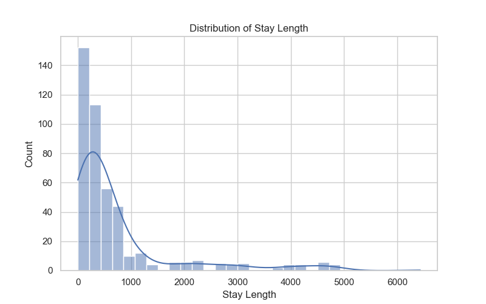
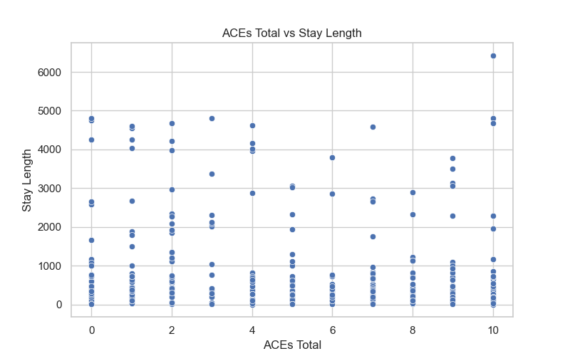
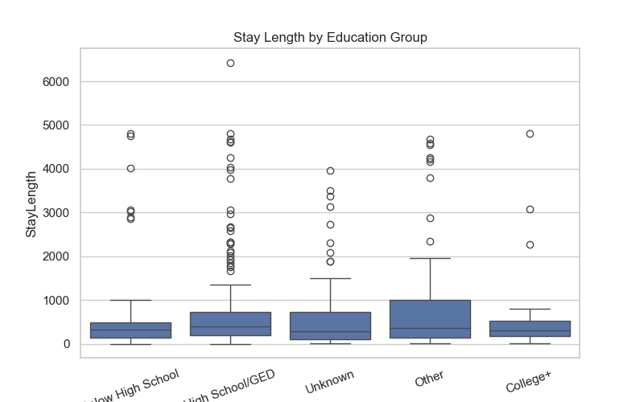
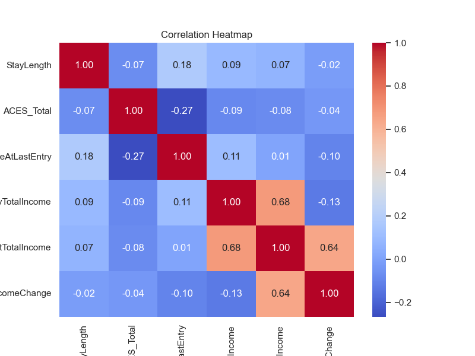

# Client Stability Analysis: Modeling Housing Outcomes with ACEs, Victimization, and Demographic Data

## Overview
This project analyzes how adverse childhood experiences (ACEs), victimization history, demographic factors, and income relate to housing stability outcomes. Using Python, I cleaned and merged multiple client-level datasets, performed exploratory data analysis, and built predictive models to better understand the factors associated with stay length.

The project was designed to support data-informed intervention strategies by identifying patterns across client risk factors and stability outcomes.
## Business Problem
Housing stability is shaped by a combination of economic, demographic, and trauma-related factors. Organizations serving vulnerable populations often need better ways to identify which clients may require additional support.

This project explores the following questions:
- How do ACEs, victimization history, and demographic characteristics relate to housing stability?
- Which client-level factors appear most associated with stay length?
- Can predictive modeling help explain or estimate housing stability outcomes?
## Data
This analysis uses merged client-level data from multiple Excel sources, including:
- Client housing and demographic records
- ACEs survey responses
- Victimization survey responses

After merging and preprocessing, the dataset included variables related to:
- Stay length
- Age
- Entry and latest income
- Education
- Race and sex
- Disability and veteran status
- Domestic violence indicators
- ACEs total score
- Victimization history
## Tools & Technologies
- Python
- Pandas
- NumPy
- Matplotlib
- Seaborn
- Scikit-learn
- Jupyter Notebook
- Excel
- Tableau

## Data Cleaning & Preparation
To prepare the data for analysis, I:
- Loaded and reviewed multiple Excel sheets containing client, ACEs, and victimization data
- Standardized column names across datasets
- Merged the files using a shared client ID
- Converted numeric fields such as stay length, age, and income into usable formats
- Replaced invalid negative values in stay length
- Created new variables such as income change, education group, race group, age group, ACE risk category, and income level
- Addressed missing values through imputation during model building
## Exploratory Data Analysis
I used exploratory analysis and visualizations to examine:
- The distribution of stay length
- The relationship between ACEs total score and stay length
- Differences in stay length across education groups
- Correlations among stay length, age, income, and ACEs
- Risk patterns across income and demographic variables

These analyses helped identify broad patterns in the data and informed the feature selection process for modeling.
## Visualizations

### Stay Length Distribution

### ACEs vs Stay Length

### Stay Length by Education

### Correlation Heatmap

## Modeling Approach
I built and compared two regression models to estimate stay length:
- Linear Regression
- Random Forest Regressor

### Model Features
The models included variables such as:
- ACEs total score
- Age at last entry
- Entry income
- Income change
- Sex
- Race group
- Education group
- Disability status
- Domestic violence indicator
- Veteran status

### Model Results
| Model | MAE | RMSE | R² |
|------|-----|------|----|
| Linear Regression | 758.85 | 1158.75 | -0.021 |
| Random Forest | 661.19 | 1081.44 | 0.11 |

The Random Forest model outperformed linear regression, suggesting that relationships in the data were non-linear and that a more flexible model was better suited for the problem.
## Key Findings
- Housing stability was only partially predictable using the available variables
- Random Forest performed better than linear regression, indicating non-linear relationships in the data
- ACEs and victimization history contributed useful context, but were not strong standalone predictors
- Income-related and demographic variables appeared to be more informative than trauma-related variables alone
- The relatively low R² suggests that important drivers of housing stability were not captured in the dataset
## Business Recommendations
Based on the analysis, I would recommend:
- Using predictive analytics as a support tool rather than a standalone decision-maker
- Identifying clients through multi-factor risk profiles instead of relying on a single variable
- Improving data collection around program participation, case management, and support services
- Prioritizing early interventions for low-income clients with multiple risk indicators
- Combining model outputs with practitioner expertise to guide client support strategies
## Project Files
- `client_stability_analysis.ipynb` – main analysis notebook
- `README.md` – project summary

> Note: Raw data files are not included in this repository for privacy and confidentiality reasons.
## Next Steps
Future improvements could include:
- Adding more program-level and case management variables
- Testing classification models for positive versus negative housing outcomes
- Building an interactive Tableau dashboard for stakeholder reporting
- Exploring feature importance in more detail
- Expanding the project with larger datasets for stronger predictive performance
## Author 
Rodney Hunter
